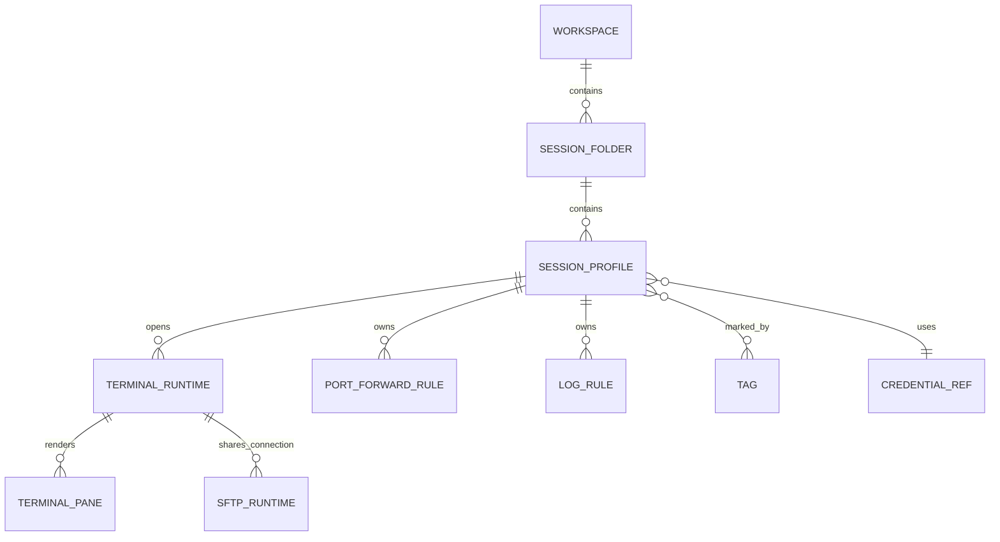

# YShell 产品需求说明

## 1. 背景与目标

YShell 是面向开发者、运维工程师、SRE、安全研究员和数据库/中间件维护人员的跨平台 SSH 终端客户端。目标不是“能打开一个 shell”的简易终端，而是提供接近 Xshell 的专业远程会话工作台：用户可以长期维护大量主机、快速找到并连接会话、同时操作多个终端、记录操作日志、进行 SFTP 文件传输、配置跳板机和端口转发，并在 Windows、macOS、Linux 上获得一致体验。

当前工程只应被视为技术壳和早期验证，不代表产品功能完成。后续实施必须以本文定义的功能、交互和验收标准为准。

## 2. 目标用户与关键场景

| 用户 | 典型任务 | 关键痛点 | YShell 必须提供的能力 |
| --- | --- | --- | --- |
| 后端开发 | 登录测试机、查看日志、重启服务、端口转发调试接口 | 会话多、命令重复、容易连错环境 | 会话树、收藏、标签颜色、命令片段、隧道、危险命令提示 |
| 运维/SRE | 批量巡检、执行维护命令、审计操作记录 | 多主机并发、需要日志、误操作风险高 | 多标签/分屏、广播输入、会话日志、批量连接、确认机制 |
| 安全研究员 | 使用多套密钥和代理访问实验环境 | 认证方式复杂、代理链多、主机密钥敏感 | 密钥管理、代理/跳板机、主机密钥校验、配置隔离 |
| 数据库/中间件管理员 | 长时间保持连接、上传脚本、下载备份 | 连接掉线、文件传输麻烦 | 自动重连、保活、SFTP、传输队列、会话恢复 |
| 团队负责人 | 统一分发非敏感连接模板 | 配置难共享，凭据不能泄露 | 配置导入导出、模板、凭据脱敏、团队源草案 |

## 3. 产品范围

### 3.1 必须实现的核心能力

1. **本地终端**：支持 Windows PowerShell/CMD/Git Bash/WSL、macOS zsh/bash、Linux bash/zsh/fish；支持 PTY resize、复制粘贴、搜索、链接识别、主题和字体。
2. **SSH 连接**：支持密码、键盘交互、私钥、SSH Agent；支持主机密钥校验、保活、超时、压缩、环境变量、启动命令。
3. **会话管理**：支持文件夹树、拖拽排序、搜索、标签、收藏、最近连接、复制、批量编辑、导入导出。
4. **标签页与分屏**：支持多标签、拖拽排序、重命名、锁定、克隆、横向/纵向分屏、布局保存和恢复。
5. **广播输入**：支持向当前标签、选中窗格、选中会话组同步输入；必须有明显状态提示和多行/危险命令确认。
6. **日志与审计**：支持手动/自动日志、日志命名模板、打开日志目录、日志状态提示、脱敏策略。
7. **SFTP 文件传输**：支持从 SSH 会话打开文件面板，上传、下载、拖放、队列、冲突处理、失败重试。
8. **高级连接**：支持 HTTP/SOCKS 代理、跳板机链、本地/远程/动态端口转发、自动重连。
9. **命令效率工具**：支持命令片段、快速命令栏、命令历史搜索、全局命令面板、快捷键自定义。
10. **配置与安全**：支持配置迁移、备份、导入导出、凭据安全存储、主机密钥管理、敏感字段脱敏。

### 3.2 暂不实现或延后实现

- Telnet、串口、RDP、VNC 可作为后续协议插件，不进入首个可用版本。
- 团队云同步、在线账号体系、插件市场进入平台化阶段后再设计。
- 终端内 AI 助手不作为基础可用版本的验收项。

## 4. 信息架构与核心对象

### 4.1 Workspace

- `id`：工作区 ID。
- `name`：工作区名称。
- `default_profile_id`：默认本地终端配置。
- `settings_ref`：工作区设置引用。
- 验收：切换工作区后，会话树、最近连接、标签布局、默认日志路径按工作区隔离。

### 4.2 SessionProfile

- 基础：`id`、`name`、`folder_id`、`icon`、`color`、`tags`、`description`、`created_at`、`updated_at`、`last_connected_at`。
- 连接：`protocol`、`host`、`port`、`username`、`timeout_sec`、`keepalive_sec`、`reconnect_policy`。
- 认证：`auth_method`、`credential_ref`、`private_key_path`、`agent_required`、`keyboard_interactive_enabled`。
- 代理/跳板：`proxy_ref`、`jump_chain`。
- 终端：`terminal_type`、`encoding`、`startup_command`、`env`、`scrollback_lines`。
- 外观：`font_family`、`font_size`、`theme_id`、`cursor_style`、`background_opacity`。
- 日志：`auto_log_enabled`、`log_path_template`、`log_format`。
- 验收：配置文件不得保存密码、私钥口令、代理密码；导出默认移除 `credential_ref` 或用占位符脱敏。

### 4.3 TerminalRuntime

- `runtime_id`：运行实例 ID。
- `profile_id`：来源会话，可为空。
- `tab_id`、`pane_id`：前端布局定位。
- `status`：`connecting | authenticating | connected | reconnecting | disconnected | failed | closing`。
- `transport`：`local_pty | ssh_shell | ssh_exec`。
- `created_at`、`connected_at`、`exit_code`、`error_summary`。
- 验收：关闭标签/窗格必须关闭对应 runtime；应用退出不得残留子进程或 SSH 通道。

## 5. 功能需求

### 5.1 本地终端

- FR-LOCAL-01：启动应用时默认打开一个本地终端，默认 shell 按平台自动识别，用户可在设置中指定。
- FR-LOCAL-02：终端窗口 resize 后，后端 PTY 行列必须与前端 xterm 行列一致。
- FR-LOCAL-03：支持复制、粘贴、选中即复制（可选）、右键菜单、URL 点击打开、终端搜索。
- FR-LOCAL-04：支持多行粘贴确认，超过 3 行或包含换行的粘贴默认弹窗确认。

### 5.2 快速连接

- FR-QC-01：顶部和会话侧边栏均提供“快速连接”入口。
- FR-QC-02：用户只输入 `host` 时，默认协议 SSH、端口 22、用户名为当前系统用户名。
- FR-QC-03：支持 `user@host:port` 粘贴解析；解析失败时保留原文本并提示错误。
- FR-QC-04：连接失败后面板不清空，错误显示在面板和状态栏，用户可修改后重试。
- FR-QC-05：勾选“保存为会话”时必须填写名称，默认名称为 `user@host`。

### 5.3 SSH 连接

- FR-SSH-01：支持密码、键盘交互、私钥、Agent 四类认证方式。
- FR-SSH-02：未知主机密钥必须展示指纹、算法、主机、端口，用户可接受一次、永久接受或取消。
- FR-SSH-03：主机密钥变化必须阻断连接，默认只允许取消；“替换已保存密钥”必须二次确认。
- FR-SSH-04：支持连接超时、保活间隔、压缩、伪终端、启动命令。
- FR-SSH-05：支持自动重连策略：不重连、断线询问、自动重连 N 次、无限重连；重连必须保留终端历史和状态提示。

### 5.4 会话树

- FR-SESSION-01：左侧会话树支持文件夹、会话、分隔符；支持拖拽移动和排序。
- FR-SESSION-02：树节点显示名称、图标/颜色、连接状态、收藏标记，可选择显示 `user@host:port`。
- FR-SESSION-03：右键菜单包含连接、新标签打开、新窗口打开、编辑、复制、删除、重命名、导出、打开 SFTP、批量操作。
- FR-SESSION-04：搜索支持名称、主机、用户名、标签、备注；结果高亮匹配文字。
- FR-SESSION-05：删除文件夹时必须提示将删除/移动内部会话，默认选择“移动到根目录”而不是直接删除。

### 5.5 标签页、分屏和布局

- FR-TAB-01：每个标签显示名称、连接状态、活动输出点、日志状态、锁定状态。
- FR-TAB-02：支持拖拽排序、关闭当前、关闭其他、关闭右侧、复制标签、重命名、锁定。
- FR-SPLIT-01：支持横向和纵向分屏；分隔条可拖拽，双击平均分配。
- FR-SPLIT-02：新分屏可选择克隆当前会话、本地 shell 或从会话树选择。
- FR-SPLIT-03：标签关闭前如存在活跃连接，必须确认；锁定标签不允许被“关闭其他”关闭。
- FR-LAYOUT-01：支持保存当前标签布局为模板，并从模板恢复。

### 5.6 广播输入

- FR-BROADCAST-01：广播范围包括当前标签全部窗格、当前窗口选中标签、手动勾选的会话/窗格。
- FR-BROADCAST-02：广播开启时，状态栏、终端边框、输入提示均必须显示醒目警告。
- FR-BROADCAST-03：粘贴多行、包含危险关键字或广播目标超过 3 个时必须弹窗确认。
- FR-BROADCAST-04：广播日志需要记录开启/关闭时间、目标数量和操作者动作摘要，但不得记录敏感输入明文。

### 5.7 日志

- FR-LOG-01：支持手动开始/停止日志，支持会话级自动日志。
- FR-LOG-02：日志命名模板支持 `{session}`、`{host}`、`{user}`、`{date}`、`{time}`、`{tab}`。
- FR-LOG-03：日志格式支持纯文本和带时间戳文本。
- FR-LOG-04：日志路径不存在时自动创建；无权限时提示并允许选择新路径。
- FR-LOG-05：状态栏和标签必须显示日志录制状态。

### 5.8 SFTP 文件传输

- FR-SFTP-01：SSH 连接成功后可从标签或会话树打开 SFTP 面板，默认定位用户 home 目录。
- FR-SFTP-02：支持本地/远端双栏、路径栏、刷新、新建文件夹、重命名、删除、上传、下载、拖放。
- FR-SFTP-03：传输队列显示文件名、方向、大小、进度、速度、剩余时间、状态、错误。
- FR-SFTP-04：同名冲突支持覆盖、跳过、重命名、全部应用。
- FR-SFTP-05：传输中断可重试；不支持断点续传时必须明确说明。

### 5.9 端口转发、代理和跳板机

- FR-TUNNEL-01：支持本地转发、远程转发、动态 SOCKS 转发。
- FR-TUNNEL-02：转发规则可绑定会话自动启动，也可在运行时手动启动/停止。
- FR-TUNNEL-03：状态面板显示监听地址、目标地址、连接数、错误和停止按钮。
- FR-PROXY-01：支持 HTTP、SOCKS4、SOCKS5 代理，代理密码进入安全存储。
- FR-JUMP-01：支持多级跳板机链路，每级可选择独立认证方式。

### 5.10 设置、主题与快捷键

- FR-SET-01：设置按“常规、终端、外观、连接、安全、日志、快捷键、高级”分组。
- FR-SET-02：所有设置修改需要明确保存；高风险设置需要说明影响。
- FR-KEY-01：快捷键支持搜索、修改、恢复默认；冲突必须实时提示。
- FR-THEME-01：内置浅色、深色和高对比主题；终端配色可单独导入导出。

## 6. 非功能需求

| 类别 | 要求 |
| --- | --- |
| 性能 | 冷启动目标小于 2 秒；单终端持续输出 10,000 行不得明显卡顿；8 个窗格同时输出时 UI 仍可响应。 |
| 稳定性 | 关闭窗口、断网、认证失败、远端退出、resize、快速打开关闭标签均不得导致应用崩溃。 |
| 安全 | 密码/口令/代理凭据不得写入普通配置、日志、崩溃报告或遥测。 |
| 可维护性 | 前后端 IPC 必须强类型；会话模型版本化；迁移可回滚或备份。 |
| 可访问性 | 主要操作可键盘完成；焦点可见；高对比主题可用；图标必须有文本提示。 |
| 跨平台 | Windows、macOS、Linux 行为一致；平台差异必须在文档和设置中说明。 |
