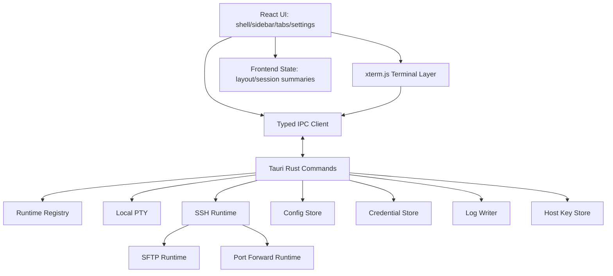
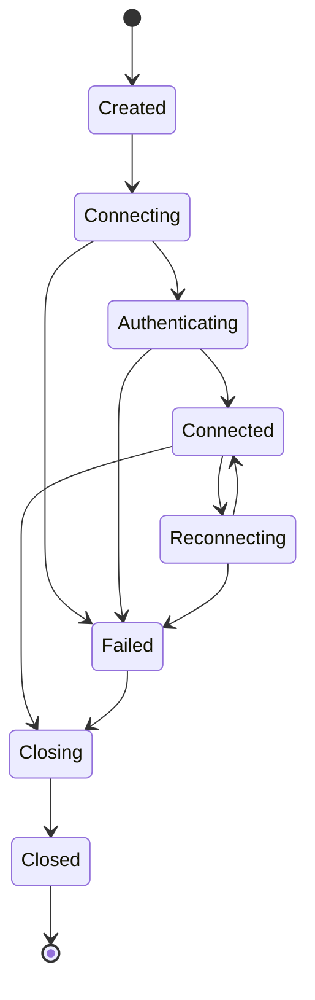

# YShell 技术架构设计

## 1. 架构目标

YShell 使用 Tauri + Rust 作为桌面壳和系统运行时，使用 React + xterm.js 作为交互与终端渲染层。架构必须支撑专业 SSH 客户端，而不是一次性演示程序。

目标：

- 前端只负责界面、布局、终端渲染和用户意图，不持有明文凭据，不保存大量终端输出。
- 后端负责 PTY、SSH、SFTP、端口转发、文件系统、配置、凭据、安全和日志。
- IPC 使用强类型命令与事件；所有长期运行任务通过事件流更新状态。
- 运行中连接与持久化配置分离，避免关闭 UI 后残留进程。
- 所有跨平台差异收敛在 platform 层。

## 2. 分层结构



## 3. 推荐目录边界

```text
src/
  app/                    # 应用启动、全局错误、主题、路由
  components/             # 可复用 UI 组件
  features/
    sessions/             # 会话树、编辑器、导入导出
    terminal/             # xterm 封装、搜索、复制粘贴
    workspace/            # 标签页、分屏、布局
    sftp/                 # 文件面板和传输队列
    tunnels/              # 端口转发状态面板
    settings/             # 设置中心与快捷键
  bindings/               # IPC 类型与客户端
src-tauri/src/
  commands/               # Tauri 命令入口，仅做参数校验和调度
  runtime/                # runtime registry 与状态机
  pty/                    # 本地 PTY
  ssh/                    # SSH shell、认证、keepalive、host key
  sftp/                   # SFTP 文件操作与队列
  tunnel/                 # local/remote/dynamic forwarding
  config/                 # 配置读写、版本迁移、导入导出
  credentials/            # 系统安全存储适配
  logging/                # 终端日志和审计事件
  platform/               # Windows/macOS/Linux 差异
```

规则：

- `commands` 不写业务细节，只做输入校验、权限校验、调用服务、返回错误。
- `runtime` 持有所有进程/连接句柄，前端只拿 opaque ID。
- `config` 与 `credentials` 严格分离。
- `terminal.output` 事件不得进入全局 Redux/Zustand 大状态，只直接写入对应 xterm 实例。

## 4. 运行时状态机



- `Created`：前端请求已通过，后端分配 runtime。
- `Connecting`：TCP/PTY 建立中。
- `Authenticating`：等待密码、键盘交互、Agent 或私钥认证。
- `Connected`：shell 已可交互。
- `Reconnecting`：网络断开且策略允许重连。
- `Failed`：连接失败但 UI 可保留标签并重试。
- `Closing`：用户关闭或应用退出。
- `Closed`：句柄释放完成。

验收：任意状态下调用 close 都必须最终进入 `Closed`，并释放子进程、socket、文件句柄、日志句柄。

## 5. IPC 规范

### 5.1 命令

| 命令 | 参数 | 返回 | 说明 |
| --- | --- | --- | --- |
| `sessions.list` | `workspace_id` | `SessionTree` | 获取会话树摘要。 |
| `sessions.save` | `SessionProfileDraft` | `SessionProfile` | 创建/更新会话。 |
| `sessions.delete` | `ids, strategy` | `DeleteResult` | 删除或移动会话/文件夹。 |
| `sessions.duplicate` | `profile_id` | `SessionProfile` | 复制会话，不复制明文凭据。 |
| `config.import` | `path, options` | `ImportPreview/Result` | 支持先预览再执行。 |
| `config.export` | `scope, options` | `ExportResult` | 默认脱敏。 |
| `terminal.open_local` | `LocalOpenRequest` | `RuntimeHandle` | 打开本地 PTY。 |
| `terminal.open_ssh` | `SshOpenRequest` | `RuntimeHandle` | 打开 SSH shell。 |
| `terminal.write` | `runtime_id, bytes` | `Ack` | 写入输入。 |
| `terminal.resize` | `runtime_id, cols, rows` | `Ack` | resize。 |
| `terminal.close` | `runtime_id, reason` | `Ack` | 关闭 runtime。 |
| `logging.start` | `runtime_id, options` | `LogHandle` | 开始日志。 |
| `logging.stop` | `runtime_id` | `Ack` | 停止日志。 |
| `sftp.open` | `runtime_id/profile_id` | `SftpHandle` | 打开 SFTP。 |
| `sftp.list` | `handle, path` | `RemoteEntry[]` | 列目录。 |
| `sftp.transfer` | `TransferRequest` | `TransferId` | 创建传输任务。 |
| `tunnel.start` | `runtime_id/profile_id, rule` | `TunnelId` | 启动端口转发。 |
| `tunnel.stop` | `tunnel_id` | `Ack` | 停止转发。 |
| `credentials.set` | `credential` | `CredentialRef` | 写入安全存储。 |
| `credentials.delete` | `credential_ref` | `Ack` | 删除凭据。 |
| `host_keys.accept` | `challenge_id, scope` | `Ack` | 接受主机密钥。 |

### 5.2 事件

| 事件 | Payload | 说明 |
| --- | --- | --- |
| `terminal.output` | `runtime_id, seq, bytes` | 终端输出，必须有序。 |
| `terminal.status` | `runtime_id, status, message` | 状态变化。 |
| `terminal.exit` | `runtime_id, exit_code, signal` | 进程/通道退出。 |
| `terminal.error` | `runtime_id, error` | 运行时错误。 |
| `host_key.challenge` | `challenge_id, host, fingerprint` | 等待用户确认。 |
| `sessions.changed` | `workspace_id, version` | 会话树变化。 |
| `log.status` | `runtime_id, enabled, path` | 日志状态。 |
| `sftp.progress` | `transfer_id, progress` | 传输进度。 |
| `tunnel.status` | `tunnel_id, status` | 转发状态。 |

## 6. 数据存储

### 6.1 配置文件

推荐使用版本化 JSON，后续可迁移 SQLite。基本结构：

```json
{
  "config_version": 1,
  "workspaces": [],
  "folders": [],
  "profiles": [],
  "settings": {},
  "keybindings": [],
  "themes": []
}
```

要求：

- 每次迁移前自动备份旧配置。
- 导入前生成预览，列出新增、覆盖、冲突、无效项。
- 导出默认不包含凭据引用；用户明确选择包含引用时也不能包含明文。
- 配置写入必须原子化：写临时文件、fsync、rename。

### 6.2 凭据存储

- Windows：优先 Windows Credential Manager。
- macOS：优先 Keychain。
- Linux：优先 Secret Service/libsecret；不可用时提示用户“不保存”或“加密文件存储”。
- 凭据值只通过后端读取，前端只保存 `credential_ref` 和状态。
- 诊断日志、终端日志、错误消息必须脱敏。

### 6.3 主机密钥

主机密钥存储字段：

- `host`、`port`、`algorithm`、`fingerprint_sha256`、`public_key`。
- `first_seen_at`、`last_seen_at`、`accepted_by`、`source`。

未知密钥可以接受一次或永久保存；变化密钥必须阻断连接并要求二次确认。

## 7. SSH 技术策略

首个可用版本可以选择两种策略之一，但验收行为必须一致：

1. **系统 OpenSSH 方案**：用 PTY 启动系统 `ssh`，复用用户 known_hosts、Agent、配置文件；优点是兼容性高，缺点是 SFTP/隧道管理需要额外封装。
2. **Rust SSH 库方案**：直接使用 Rust SSH 库建立连接；优点是事件和认证可控，缺点是兼容性和算法覆盖需要充分验证。

无论选择哪种：

- 密码和键盘交互不能被日志记录。
- resize 必须同步到远端 pty。
- keepalive 和 timeout 必须可配置。
- 断线必须产生明确状态事件。
- 主机密钥策略必须满足产品验收。

## 8. 性能与可靠性约束

- 终端输出事件采用序列号；前端检测乱序和丢包。
- 高吞吐输出采用批处理/节流，但不得造成输入延迟明显升高。
- xterm 实例销毁时必须解绑事件监听，避免内存泄漏。
- 分屏拖拽 resize 视觉实时，后端 resize 节流到 30-60ms。
- 日志写入使用后台任务，不阻塞终端输出。
- 应用退出时执行 shutdown manager：停止广播、停止 SFTP 传输、关闭隧道、停止日志、关闭 runtime。

## 9. 安全边界

| 风险 | 约束 |
| --- | --- |
| 明文凭据泄露 | UI 状态、配置、导出、日志、崩溃报告均不得包含明文密码/口令。 |
| 主机伪装 | 主机密钥未知需确认，变化需阻断。 |
| 路径注入 | 日志路径、私钥路径、导入导出路径必须规范化和权限校验。 |
| 广播误操作 | 状态强提示、多行确认、危险命令确认、目标数量提示。 |
| 命令注入 | 启动系统 ssh 时参数必须数组传递，不拼接 shell 字符串。 |
| 越权 runtime | IPC 必须校验 runtime 所属窗口/工作区。 |

## 10. 测试策略

- 单元测试：配置迁移、连接字符串解析、快捷键冲突、危险命令检测、日志模板。
- 集成测试：本地 PTY open/write/resize/close，SSH mock server 认证与断线，SFTP 队列。
- E2E：快速连接、会话 CRUD、标签关闭确认、分屏 resize、广播确认、导入导出。
- 跨平台手测矩阵：Windows 11、macOS 最新两个主版本、Ubuntu LTS。
- 发布门禁：所有验收矩阵 P0/P1 项通过，且无明文凭据泄露测试失败。
