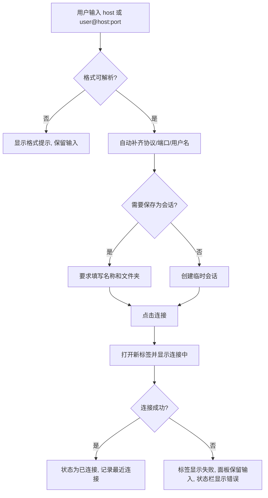
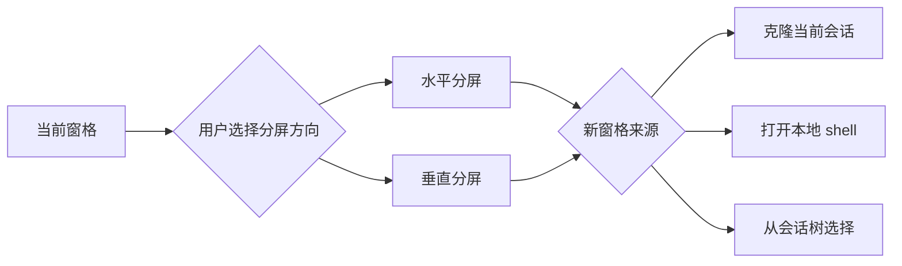

# YShell 体验与交互设计

## 1. 体验目标

YShell 的交互目标是让熟悉 Xshell 的用户在 10 分钟内完成迁移：左侧是可管理的大量会话，顶部是快速连接与命令入口，中间是多标签、多分屏终端，下方是连接、日志、编码、尺寸和风险状态。视觉可以现代，但操作必须专业、直接、稳定。

关键原则：

- **会话优先**：打开应用后，用户首先看到会话树、最近连接和快速连接，而不是空白欢迎页。
- **终端优先**：终端区域最大化利用空间，所有面板均可折叠。
- **状态清晰**：连接中、认证中、已连接、失败、重连、日志中、广播中必须一眼可见。
- **错误可恢复**：连接失败、导入失败、认证失败不清空用户输入，不破坏当前布局。
- **高风险强提示**：广播、多行粘贴、删除、主机密钥变化、批量操作必须二次确认。

## 2. 主界面布局

```html
<div class="yshell-window">
  <header class="title-command-bar">
    <button>☰</button><strong>YShell</strong>
    <input placeholder="快速连接：user@host:22 或搜索会话" />
    <button>新建会话</button><button>命令面板</button><button>设置</button>
  </header>
  <main class="body">
    <aside class="session-sidebar">
      <section class="quick-connect">快速连接表单</section>
      <section class="session-tree">文件夹 / 会话树 / 收藏 / 最近连接</section>
    </aside>
    <section class="workspace">
      <nav class="tab-bar">标签页 + 状态徽标 + 关闭按钮</nav>
      <section class="terminal-grid">xterm.js 终端窗格 / 分屏</section>
      <footer class="status-bar">连接状态 | user@host | 80x24 | UTF-8 | 日志 | 广播</footer>
    </section>
    <aside class="inspector" hidden>属性 / SFTP / 传输队列 / 隧道</aside>
  </main>
</div>
```

```text
┌────────────────────────────────────────────────────────────────────────────┐
│ ☰ YShell  [快速连接或搜索: user@host:22________________] [+会话] [⌘K] [⚙] │
├───────────────────┬────────────────────────────────────────────────────────┤
│ 快速连接           │ 标签: ● prod-1  ○ dev-2  🔒 audit-log      [+]         │
│ 协议 SSH           ├────────────────────────────────────────────────────────┤
│ 主机               │ ┌──────────────────────────┬─────────────────────────┐ │
│ 用户/端口          │ │ pane-1: prod-1           │ pane-2: prod-2          │ │
│ [连接] [保存]      │ │                          │                         │ │
│───────────────────│ │        terminal          │        terminal         │ │
│ 🔎 搜索会话         │ │                          │                         │ │
│ ★ 收藏             │ └──────────────────────────┴─────────────────────────┘ │
│ ▾ 生产             │ 状态: 已连接 user@host  120x36 UTF-8  日志● 广播关闭   │
│   🟢 prod-1        │                                                        │
│   ⚪ prod-2        │                                                        │
│ ▾ 测试             │                                                        │
└───────────────────┴────────────────────────────────────────────────────────┘
```

### 2.1 顶部命令栏

- 左侧汉堡按钮用于展开/折叠侧边栏。
- 中间输入框同时承担快速连接和会话搜索：输入符合连接格式时展示“连接到 …”，输入普通文本时展示搜索结果。
- 右侧提供新建会话、命令面板、全局设置。
- 命令面板快捷键建议 `Ctrl+Shift+P` / macOS `Cmd+Shift+P`。

### 2.2 会话侧边栏

- 宽度默认 280px，可拖拽到 220px-480px，可完全折叠。
- 顶部固定快速连接卡片；用户可在设置中隐藏。
- 会话树包含“收藏”“最近连接”“全部会话”。
- 节点状态：绿色已连接、黄色连接中/重连、红色失败、灰色未连接、蓝色有活动输出。
- 右键菜单必须根据节点类型动态展示可用操作。

### 2.3 工作区

- 标签栏支持横向滚动和下拉列表，标签过多时不得挤压到不可读。
- 终端窗格激活时显示 2px 强调边框；失焦窗格边框弱化但文本不变淡。
- 右侧 Inspector 默认隐藏，可用于显示会话属性、SFTP、传输队列、隧道状态。

### 2.4 状态栏

状态栏从左到右展示：

1. 当前 runtime 状态。
2. 当前会话 `user@host:port` 或本地 shell 名称。
3. 延迟/心跳或最近输出时间。
4. 终端尺寸 `cols x rows`。
5. 编码、换行模式、终端类型。
6. 日志状态与路径快捷入口。
7. 广播输入状态。
8. 错误提示入口。

## 3. 快速连接交互



字段与规则：

| 字段 | 默认值 | 校验 | 错误提示 |
| --- | --- | --- | --- |
| 协议 | SSH | 必填 | 请选择协议 |
| 主机 | 空 | 必填，允许域名/IP | 主机不能为空 |
| 端口 | 22 | 1-65535 | 端口必须是 1-65535 |
| 用户名 | 系统用户名 | 非空 | 用户名不能为空 |
| 认证方式 | Agent/私钥优先，可配置 | 必填 | 请选择认证方式 |
| 私钥路径 | 空 | 私钥认证时必填 | 请选择私钥文件 |
| 保存名称 | `user@host` | 保存时必填且同文件夹内唯一 | 会话名称重复 |

连接失败时：

- 不关闭快速连接面板。
- 不清空主机、用户、端口、私钥路径。
- 新标签可保留为“连接失败”状态，提供“重试”“编辑”“关闭”。
- 状态栏显示最近错误，点击可查看完整错误。

## 4. 会话属性编辑器

会话编辑采用左侧分组导航 + 右侧表单：

```text
┌ 新建/编辑会话 ────────────────────────────────────────┐
│ 常规 | 连接 | 认证 | 代理/跳板 | 终端 | 外观 | 日志 | 高级 │
├───────────────────────────────────────────────────────┤
│ 名称 [prod-api-01________________]  文件夹 [生产/应用] │
│ 标签 [prod] [api] [linux]           颜色 [红色]        │
│ 备注 [_____________________________________________]   │
│                                                       │
│                         [测试连接] [取消] [保存]       │
└───────────────────────────────────────────────────────┘
```

交互要求：

- 表单有未保存修改时关闭必须确认。
- “测试连接”不保存配置，只使用当前表单值打开临时测试连接。
- 保存失败不得关闭编辑器。
- 密码、私钥口令、代理密码字段只允许写入安全存储，不允许显示已保存明文；已保存时展示“已保存，可替换/删除”。

## 5. 标签页与分屏交互

### 5.1 标签页

- 双击会话树节点：在新标签打开。
- `Ctrl+T`：新建本地终端标签。
- `Ctrl+W`：关闭当前标签；活跃连接需确认。
- 中键点击标签：关闭标签。
- 拖拽标签：调整顺序；拖出窗口创建新窗口（后续阶段）。
- 标签右键菜单：重命名、复制连接、克隆标签、锁定、关闭、关闭其他、关闭右侧、开始日志、打开 SFTP。

### 5.2 分屏



- `Alt+Shift+-`：上下分屏。
- `Alt+Shift+\`：左右分屏。
- `Alt+方向键`：切换活动窗格。
- 拖拽分隔条实时改变视觉尺寸，后端 resize 节流执行。
- 关闭最后一个窗格等同关闭标签。

## 6. 广播输入设计

广播输入必须设计成“危险模式”：

```text
┌────────────────────── 广播输入已开启 ──────────────────────┐
│ 范围：当前标签 4 个窗格                                     │
│ 风险：所有键盘输入会同步发送到目标终端。                    │
│ [暂停广播] [选择目标] [关闭广播]                            │
└─────────────────────────────────────────────────────────────┘
```

- 开启入口：状态栏、命令面板、标签右键、快捷键。
- 开启后：状态栏变为橙/红色，所有目标窗格显示边框，输入光标附近显示“广播中”。
- 目标选择器展示会话名、主机、当前目录/标题、连接状态。
- 多行粘贴确认文案必须包含目标数量和前 3 行预览。
- 危险关键字列表可配置，默认包含 `rm -rf`、`mkfs`、`reboot`、`shutdown`、`poweroff`、`dd if=`、`:(){ :|:& };:`。

## 7. 主机密钥确认

未知主机密钥弹窗：

```text
主机密钥未保存
主机：example.com:22
算法：ssh-ed25519
指纹：SHA256:xxxxxxxxxxxxxxxx

请确认这是预期的服务器。接受后将保存到主机密钥数据库。
[取消连接] [仅本次接受] [永久接受]
```

主机密钥变化弹窗：

- 标题必须为危险语义：“主机密钥已变化，连接已阻止”。
- 展示旧指纹、新指纹、首次保存时间、最近使用时间。
- 默认按钮为“取消连接”。
- “替换保存的密钥并继续”必须二次确认，且记录审计事件。

## 8. SFTP 面板

SFTP 可作为右侧 Inspector 或独立标签打开。首版建议双栏布局：

```text
┌ 本地: /Users/me/downloads ───────┬ 远端: /home/app ──────────────┐
│ [..]  file-a.log       12 KB     │ [..]  release.sh      2 KB     │
│      backup.tar.gz     1 GB      │      logs/                    │
├──────────────────────────────────┴───────────────────────────────┤
│ 传输队列: app.log ↓ 45%  1.2MB/s  [暂停] [取消]                 │
└──────────────────────────────────────────────────────────────────┘
```

交互：

- 拖本地文件到远端列表触发上传，拖远端文件到本地触发下载。
- 删除远端文件必须确认；批量删除展示数量。
- 覆盖冲突弹窗支持“覆盖、跳过、重命名、全部应用”。
- 远端路径栏支持手动输入和历史记录。

## 9. 设置中心

设置页分组：

1. 常规：启动行为、默认工作区、语言、更新策略。
2. 终端：默认 shell、字体、字号、滚动行数、光标、复制粘贴。
3. 外观：主题、侧边栏位置、透明度、紧凑模式。
4. 连接：默认超时、保活、自动重连、SSH 可执行文件/库策略。
5. 安全：凭据存储、主机密钥、危险命令、多行粘贴。
6. 日志：默认路径、自动日志、命名模板、保留策略。
7. 快捷键：搜索、修改、冲突检测、导入导出。
8. 高级：配置目录、诊断、开发者工具、重置。

## 10. 空状态、错误和通知

- 无会话时侧边栏展示“新建会话、导入配置、快速连接”三个主要按钮。
- 连接错误以非阻塞通知 + 标签内错误页展示。
- 长任务使用进度条；用户可取消。
- 重要错误可复制诊断信息，但必须自动脱敏主机密码、token、私钥口令。
