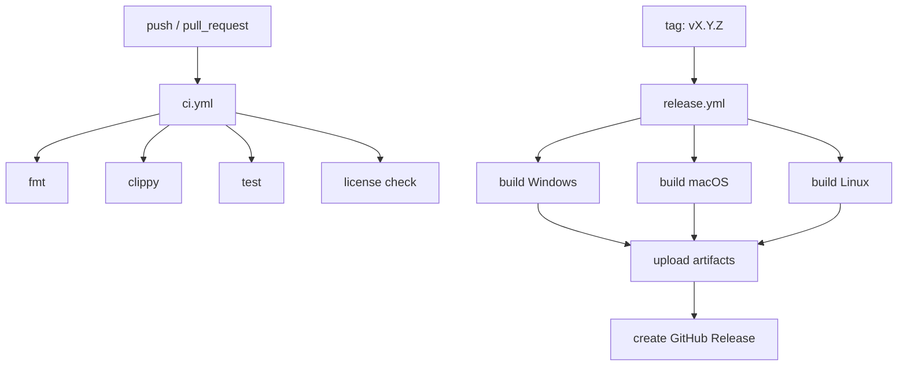

# YShell GitHub Actions 自动发布配置

本文档定义 CI、检查、打包和自动发布 workflow。当前仓库还没有 Rust workspace，因此这些配置先作为文档保存；完成 Milestone 0 后，应把对应 YAML 放入 `.github/workflows/`。

## 1. Workflow 总览



## 2. `ci.yml`

保存路径：`.github/workflows/ci.yml`

```yaml
name: CI

on:
  push:
    branches:
      - master
      - main
      - "release/**"
  pull_request:
    branches:
      - master
      - main

permissions:
  contents: read

env:
  CARGO_TERM_COLOR: always
  RUSTFLAGS: "-D warnings"

jobs:
  fmt:
    name: Format
    runs-on: ubuntu-latest
    steps:
      - name: Checkout
        uses: actions/checkout@v4

      - name: Install Rust
        uses: dtolnay/rust-toolchain@stable
        with:
          components: rustfmt

      - name: Check formatting
        run: cargo fmt --all --check

  clippy:
    name: Clippy
    runs-on: ubuntu-latest
    steps:
      - name: Checkout
        uses: actions/checkout@v4

      - name: Install Linux UI dependencies
        run: |
          sudo apt-get update
          sudo apt-get install -y \
            libx11-dev \
            libxcb1-dev \
            libxcb-render0-dev \
            libxcb-shape0-dev \
            libxcb-xfixes0-dev \
            libssl-dev \
            pkg-config

      - name: Install Rust
        uses: dtolnay/rust-toolchain@stable
        with:
          components: clippy

      - name: Cache cargo
        uses: Swatinem/rust-cache@v2

      - name: Run clippy
        run: cargo clippy --workspace --all-targets --all-features -- -D warnings

  test:
    name: Test
    strategy:
      fail-fast: false
      matrix:
        os:
          - ubuntu-latest
          - windows-latest
          - macos-latest
    runs-on: ${{ matrix.os }}
    steps:
      - name: Checkout
        uses: actions/checkout@v4

      - name: Install Linux UI dependencies
        if: runner.os == 'Linux'
        run: |
          sudo apt-get update
          sudo apt-get install -y \
            libx11-dev \
            libxcb1-dev \
            libxcb-render0-dev \
            libxcb-shape0-dev \
            libxcb-xfixes0-dev \
            libssl-dev \
            pkg-config

      - name: Install Rust
        uses: dtolnay/rust-toolchain@stable

      - name: Cache cargo
        uses: Swatinem/rust-cache@v2

      - name: Run tests
        run: cargo test --workspace --all-features

  deny:
    name: License and advisory check
    runs-on: ubuntu-latest
    steps:
      - name: Checkout
        uses: actions/checkout@v4

      - name: Install cargo-deny
        uses: taiki-e/install-action@cargo-deny

      - name: Run cargo deny
        run: cargo deny check
```

## 3. `release.yml`

保存路径：`.github/workflows/release.yml`

```yaml
name: Release

on:
  push:
    tags:
      - "v*.*.*"

permissions:
  contents: write

env:
  CARGO_TERM_COLOR: always
  APP_NAME: yshell

jobs:
  build:
    name: Build ${{ matrix.target }}
    strategy:
      fail-fast: false
      matrix:
        include:
          - os: windows-latest
            target: x86_64-pc-windows-msvc
            artifact_name: yshell-windows-x86_64
            binary_name: yshell.exe
            archive_ext: zip
          - os: macos-latest
            target: x86_64-apple-darwin
            artifact_name: yshell-macos-x86_64
            binary_name: yshell
            archive_ext: tar.gz
          - os: macos-latest
            target: aarch64-apple-darwin
            artifact_name: yshell-macos-aarch64
            binary_name: yshell
            archive_ext: tar.gz
          - os: ubuntu-latest
            target: x86_64-unknown-linux-gnu
            artifact_name: yshell-linux-x86_64
            binary_name: yshell
            archive_ext: tar.gz

    runs-on: ${{ matrix.os }}

    steps:
      - name: Checkout
        uses: actions/checkout@v4

      - name: Install Linux UI dependencies
        if: runner.os == 'Linux'
        run: |
          sudo apt-get update
          sudo apt-get install -y \
            libx11-dev \
            libxcb1-dev \
            libxcb-render0-dev \
            libxcb-shape0-dev \
            libxcb-xfixes0-dev \
            libssl-dev \
            pkg-config

      - name: Install Rust
        uses: dtolnay/rust-toolchain@stable
        with:
          targets: ${{ matrix.target }}

      - name: Cache cargo
        uses: Swatinem/rust-cache@v2

      - name: Build release binary
        run: cargo build --release --locked --target ${{ matrix.target }} -p yshell-app

      - name: Prepare artifact directory
        shell: bash
        run: |
          mkdir -p dist/${{ matrix.artifact_name }}
          cp target/${{ matrix.target }}/release/${{ matrix.binary_name }} dist/${{ matrix.artifact_name }}/
          cp README.md dist/${{ matrix.artifact_name }}/README.md
          cp LICENSE dist/${{ matrix.artifact_name }}/LICENSE

      - name: Archive artifact on Windows
        if: runner.os == 'Windows'
        shell: pwsh
        run: Compress-Archive -Path dist/${{ matrix.artifact_name }}/* -DestinationPath dist/${{ matrix.artifact_name }}.zip

      - name: Archive artifact on Unix
        if: runner.os != 'Windows'
        shell: bash
        run: tar -czf dist/${{ matrix.artifact_name }}.tar.gz -C dist/${{ matrix.artifact_name }} .

      - name: Upload artifact
        uses: actions/upload-artifact@v4
        with:
          name: ${{ matrix.artifact_name }}
          path: dist/${{ matrix.artifact_name }}.${{ matrix.archive_ext }}

  publish:
    name: Publish GitHub Release
    needs: build
    runs-on: ubuntu-latest
    steps:
      - name: Checkout
        uses: actions/checkout@v4

      - name: Download artifacts
        uses: actions/download-artifact@v4
        with:
          path: release-artifacts

      - name: Create release
        uses: softprops/action-gh-release@v2
        with:
          draft: false
          prerelease: ${{ contains(github.ref_name, '-') }}
          files: release-artifacts/**/*
          generate_release_notes: true
```

## 4. `deny.toml`

保存路径：`deny.toml`

```toml
[advisories]
version = 2
yanked = "deny"
ignore = []

[licenses]
version = 2
confidence-threshold = 0.8
allow = [
  "Apache-2.0",
  "MIT",
  "BSD-2-Clause",
  "BSD-3-Clause",
  "ISC",
  "Unicode-DFS-2016"
]

[bans]
multiple-versions = "warn"
wildcards = "deny"

[sources]
unknown-registry = "deny"
unknown-git = "warn"
```

## 5. 自动发布约定

- 版本号只接受 `vMAJOR.MINOR.PATCH`，例如 `v0.1.0`。
- 带连字符的 tag 视为预发布，例如 `v0.2.0-beta.1`。
- release workflow 必须在 CI 通过后才能手动打 tag。
- 打 tag 前必须更新 `CHANGELOG.md`。
- Windows 安装包、macOS 签名、Linux AppImage 可以在 Milestone 8 拆成独立 job；早期 release 先发布压缩包。

## 6. 后续签名计划

- Windows：接入代码签名证书，签名 `.exe` 和 `.msi`。
- macOS：接入 Apple Developer ID，完成 signing 和 notarization。
- Linux：AppImage 增加 SHA256 校验文件。
- 所有平台：release 页面上传 `SHA256SUMS`。
