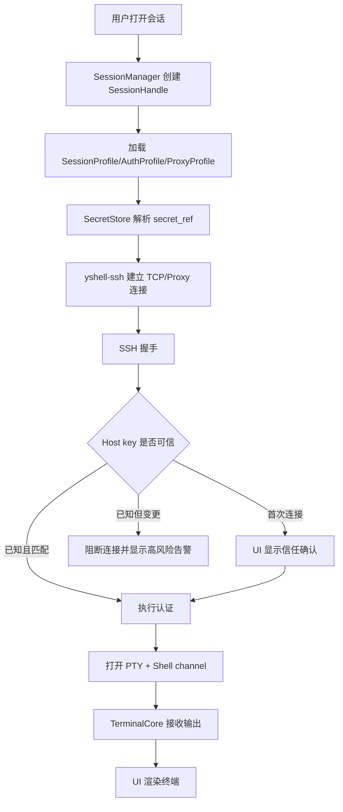
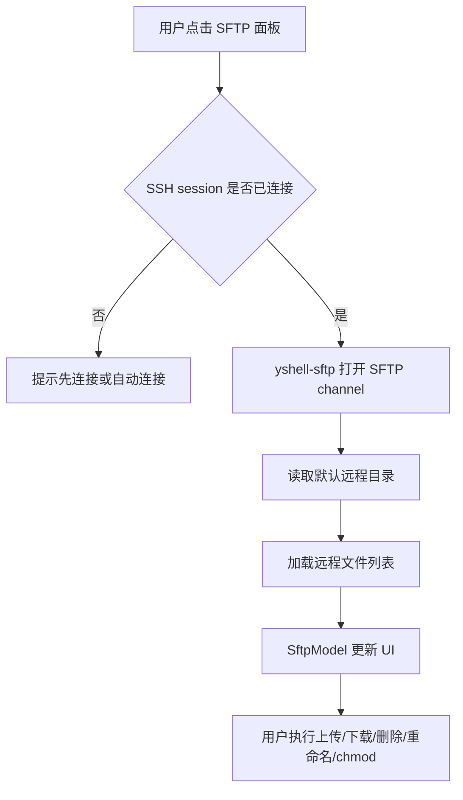
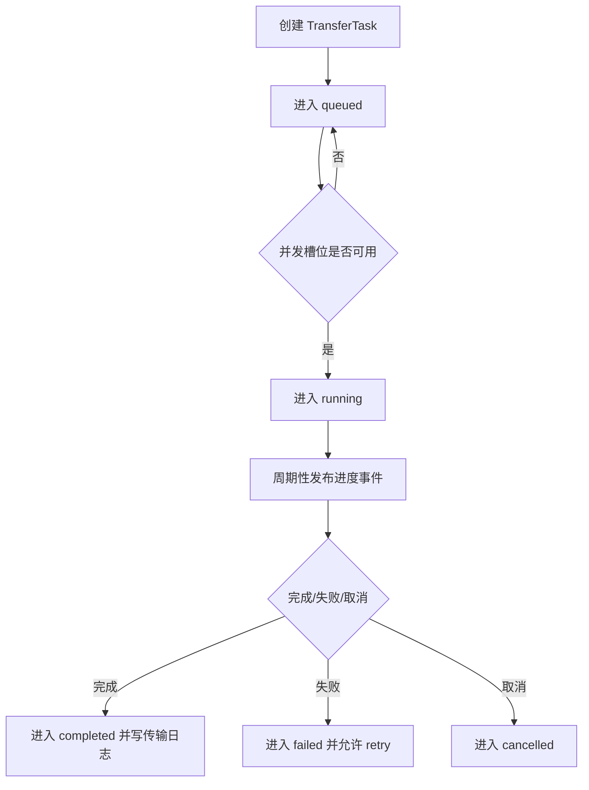

# YShell 详细开发拆分计划

本文档用于约束后续开发方向。任何实现任务都应先对照这里的模块边界、文件职责、测试要求和 UI 草图，避免在早期把 SSH、SFTP、终端渲染、配置存储和界面状态混在一起。

## 1. 代码仓库目标结构

```text
yshell/
  Cargo.toml
  crates/
    yshell-app/
    yshell-ui/
    yshell-core/
    yshell-ssh/
    yshell-sftp/
    yshell-terminal/
    yshell-config/
    yshell-secret/
    yshell-logging/
    yshell-test-support/
  ui/
    main_window.slint
    components/
    pages/
  assets/
    icons/
    themes/
  tests/
    integration/
  docs/
    product/
    dev/
  .github/
    workflows/
```

## 2. Rust Workspace 拆分

### 2.1 `crates/yshell-app`

职责：

- 程序入口。
- 初始化日志、配置目录、平台环境、主题。
- 创建 Slint 主窗口。
- 连接 UI 事件与应用服务。
- 管理应用生命周期和退出确认。

主要文件：

```text
crates/yshell-app/src/main.rs
crates/yshell-app/src/bootstrap.rs
crates/yshell-app/src/app_state.rs
crates/yshell-app/src/commands.rs
crates/yshell-app/src/error.rs
```

不得承担：

- 不直接实现 SSH 协议。
- 不直接读写 secret。
- 不直接解析终端 escape sequence。

### 2.2 `crates/yshell-ui`

职责：

- Slint 组件绑定。
- UI ViewModel。
- UI 事件到 domain command 的转换。
- 状态展示：连接中、已连接、断开、错误、传输中。

主要文件：

```text
crates/yshell-ui/src/lib.rs
crates/yshell-ui/src/models/session_tree_model.rs
crates/yshell-ui/src/models/tab_model.rs
crates/yshell-ui/src/models/sftp_model.rs
crates/yshell-ui/src/models/tunnel_model.rs
crates/yshell-ui/src/view_events.rs
crates/yshell-ui/src/view_commands.rs
```

不得承担：

- 不保存配置文件。
- 不直接持有密码或私钥 passphrase。
- 不在 UI 模型中保存大块终端 scrollback。

### 2.3 `crates/yshell-core`

职责：

- 会话生命周期。
- tab/session/sftp/tunnel/logging 的协调。
- 应用级事件总线。
- 异步任务管理和取消。

主要文件：

```text
crates/yshell-core/src/lib.rs
crates/yshell-core/src/session_manager.rs
crates/yshell-core/src/session_handle.rs
crates/yshell-core/src/session_event.rs
crates/yshell-core/src/task_supervisor.rs
crates/yshell-core/src/command_dispatcher.rs
```

核心类型：

```text
SessionManager
SessionHandle
SessionEvent
SessionCommand
TaskSupervisor
```

### 2.4 `crates/yshell-ssh`

职责：

- SSH 连接建立。
- 密码、私钥、agent、keyboard-interactive 认证。
- host key 验证。
- PTY 和 Shell channel。
- local/remote/dynamic forwarding。
- SOCKS5 和 HTTP CONNECT 代理。

主要文件：

```text
crates/yshell-ssh/src/lib.rs
crates/yshell-ssh/src/client.rs
crates/yshell-ssh/src/auth.rs
crates/yshell-ssh/src/host_key.rs
crates/yshell-ssh/src/channel.rs
crates/yshell-ssh/src/pty.rs
crates/yshell-ssh/src/forwarding.rs
crates/yshell-ssh/src/proxy.rs
crates/yshell-ssh/src/error.rs
```

### 2.5 `crates/yshell-sftp`

职责：

- SFTP channel 生命周期。
- 远程目录列表。
- 上传、下载、删除、重命名、新建目录、chmod。
- 传输队列、进度、取消、失败重试。
- 临时编辑远程文件。

主要文件：

```text
crates/yshell-sftp/src/lib.rs
crates/yshell-sftp/src/client.rs
crates/yshell-sftp/src/fs_entry.rs
crates/yshell-sftp/src/transfer_queue.rs
crates/yshell-sftp/src/transfer_task.rs
crates/yshell-sftp/src/remote_edit.rs
crates/yshell-sftp/src/error.rs
```

### 2.6 `crates/yshell-terminal`

职责：

- 终端输入输出模型。
- ANSI/VTE 解析。
- screen buffer 和 scrollback。
- 选择、复制、搜索。
- 渲染单元数据结构，不直接调用 Slint。

主要文件：

```text
crates/yshell-terminal/src/lib.rs
crates/yshell-terminal/src/grid.rs
crates/yshell-terminal/src/cell.rs
crates/yshell-terminal/src/parser.rs
crates/yshell-terminal/src/selection.rs
crates/yshell-terminal/src/search.rs
crates/yshell-terminal/src/color.rs
crates/yshell-terminal/src/input.rs
```

### 2.7 `crates/yshell-config`

职责：

- 配置路径发现。
- TOML 序列化和迁移。
- sessions、profiles、themes、commands、known_hosts、state 文件管理。
- 配置 schema 版本。

主要文件：

```text
crates/yshell-config/src/lib.rs
crates/yshell-config/src/paths.rs
crates/yshell-config/src/schema.rs
crates/yshell-config/src/session_profile.rs
crates/yshell-config/src/auth_profile.rs
crates/yshell-config/src/proxy_profile.rs
crates/yshell-config/src/sftp_profile.rs
crates/yshell-config/src/tunnel_profile.rs
crates/yshell-config/src/migration.rs
crates/yshell-config/src/store.rs
```

### 2.8 `crates/yshell-secret`

职责：

- 平台密钥链适配。
- 主密码派生密钥。
- secret 引用和加密 blob。
- 不向 UI 泄露明文 secret。

主要文件：

```text
crates/yshell-secret/src/lib.rs
crates/yshell-secret/src/secret_ref.rs
crates/yshell-secret/src/keychain.rs
crates/yshell-secret/src/master_password.rs
crates/yshell-secret/src/encrypted_store.rs
crates/yshell-secret/src/error.rs
```

### 2.9 `crates/yshell-logging`

职责：

- 会话日志。
- SFTP 传输日志。
- 日志路径模板。
- 敏感输入屏蔽。
- 日志轮转。

主要文件：

```text
crates/yshell-logging/src/lib.rs
crates/yshell-logging/src/session_logger.rs
crates/yshell-logging/src/transfer_logger.rs
crates/yshell-logging/src/path_template.rs
crates/yshell-logging/src/redaction.rs
crates/yshell-logging/src/rotation.rs
```

### 2.10 `crates/yshell-test-support`

职责：

- 测试 SSH server 启动器。
- 临时配置目录。
- fake secret store。
- fake UI event sink。
- 测试用 SFTP 文件树。

主要文件：

```text
crates/yshell-test-support/src/lib.rs
crates/yshell-test-support/src/ssh_server.rs
crates/yshell-test-support/src/temp_home.rs
crates/yshell-test-support/src/fake_secret_store.rs
crates/yshell-test-support/src/fixtures.rs
```

## 3. UI 文件拆分

```text
ui/main_window.slint
ui/components/app_menu.slint
ui/components/toolbar.slint
ui/components/status_bar.slint
ui/components/session_tree.slint
ui/components/terminal_tab_bar.slint
ui/components/terminal_view.slint
ui/components/sftp_panel.slint
ui/components/transfer_queue.slint
ui/components/tunnel_panel.slint
ui/components/quick_commands.slint
ui/pages/session_editor.slint
ui/pages/settings.slint
ui/pages/known_hosts.slint
ui/pages/about.slint
```

界面状态必须从 ViewModel 输入。Slint 文件只负责布局、控件状态和事件触发，不应包含业务判断。

## 4. 核心工作流

### 4.1 SSH 连接流程



### 4.2 SFTP 打开流程



### 4.3 文件传输流程



## 5. 事件模型

### 5.1 UI 到 Core

```text
OpenQuickConnect(input)
OpenSession(session_id)
CloseTab(tab_id)
ReconnectSession(session_id)
SendTerminalInput(session_id, bytes)
ResizeTerminal(session_id, columns, rows)
OpenSftp(session_id)
StartUpload(session_id, local_path, remote_path)
StartDownload(session_id, remote_path, local_path)
CreateTunnel(session_id, tunnel_profile)
StopTunnel(session_id, tunnel_id)
RunQuickCommand(session_id, command_id)
BroadcastInput(session_ids, text)
```

### 5.2 Core 到 UI

```text
SessionConnecting(session_id)
SessionConnected(session_id)
SessionDisconnected(session_id, reason)
SessionError(session_id, error)
TerminalOutput(session_id, bytes)
HostKeyPrompt(session_id, fingerprint)
SftpDirectoryLoaded(session_id, path, entries)
TransferProgress(task_id, bytes_done, total_bytes)
TransferCompleted(task_id)
TransferFailed(task_id, error)
TunnelStarted(session_id, tunnel_id, listen_addr)
TunnelStopped(session_id, tunnel_id)
```

## 6. 错误处理要求

- SSH 握手失败：显示主机、端口、错误类型、重试入口。
- Host key 变更：默认阻断，必须显示旧 fingerprint、新 fingerprint、known_hosts 路径。
- 认证失败：区分密码错误、私钥 passphrase 错误、agent 无 key、keyboard-interactive 失败。
- SFTP 权限错误：显示远程路径和操作类型。
- 传输失败：保留任务在队列中，允许 retry。
- 端口转发失败：显示监听地址、目标地址、系统错误码。
- 配置损坏：启动时加载备份或进入恢复模式，不直接覆盖原文件。

## 7. Milestone 任务拆分

### Milestone 0：工程骨架

- 创建 Rust workspace。
- 创建所有 crate 的空 lib/main。
- 创建 Slint 主窗口和基础 app shell。
- 创建配置目录发现逻辑。
- 创建 tracing 日志初始化。
- 创建 GitHub CI 基础检查。
- 创建跨平台 release workflow 文档对应的真实 workflow。
- 验收：`cargo test --workspace`、`cargo fmt --check`、`cargo clippy --workspace --all-targets -- -D warnings` 通过。

### Milestone 1：配置与会话模型

- 实现 `SessionProfile`、`AuthProfile`、`ProxyProfile`、`SftpProfile`、`TunnelProfile`。
- 实现 TOML 读写。
- 实现 schema version 和迁移框架。
- 实现会话树文件夹模型。
- 实现导入/导出。
- 验收：配置 round-trip 测试、损坏配置恢复测试、迁移测试通过。

### Milestone 2：SSH 终端 MVP

- 实现快速连接解析。
- 实现 SSH client adapter。
- 实现密码和私钥认证。
- 实现 host key TOFU。
- 实现 PTY 和 Shell channel。
- 实现 terminal output 到 UI。
- 验收：本地测试 SSH server 下完成登录、执行命令、resize、断开、重连。

### Milestone 3：终端仿真

- 接入 VTE/terminal parser。
- 实现 grid、scrollback、selection、search。
- 实现复制、粘贴、括号粘贴。
- 实现颜色方案和字体配置。
- 验收：ANSI colors、wide char、alternate screen、mouse mode 基础测试通过。

### Milestone 4：SFTP

- 实现 SFTP channel。
- 实现目录列表和路径导航。
- 实现上传、下载、删除、重命名、新建目录。
- 实现 chmod。
- 实现 transfer queue。
- 实现远程临时编辑。
- 验收：测试 SFTP server 下完成文件树操作、失败重试、传输日志。

### Milestone 5：会话管理 UI

- 实现 Session Manager 左侧树。
- 实现 Session Editor。
- 实现 Quick Connect。
- 实现标签页、分屏、重连入口。
- 实现最近连接、收藏、搜索。
- 验收：用户无需编辑文件即可创建、连接、修改、删除会话。

### Milestone 6：端口转发与代理

- 实现 SOCKS5 和 HTTP CONNECT 代理。
- 实现 local forwarding。
- 实现 remote forwarding。
- 实现 dynamic SOCKS5 forwarding。
- 实现 tunnel panel 状态。
- 验收：每种转发都有集成测试和 UI 状态展示。

### Milestone 7：快捷命令、日志、安全收尾

- 实现快捷命令栏。
- 实现 Compose Pane。
- 实现广播输入确认。
- 实现 session logging。
- 实现 secret store 和平台 keychain。
- 验收：敏感输入不写入日志，广播输入必须确认，secret 不明文进入配置文件。

### Milestone 8：打包与自动发布

- Windows 生成 `.msi` 或 `.exe`。
- macOS 生成 `.dmg` 或 `.app.tar.gz`，后续接入签名和 notarization。
- Linux 生成 `.AppImage`、`.deb`、`.rpm` 中至少一种。
- GitHub Actions 支持 tag 触发 release。
- 验收：推送 `vX.Y.Z` tag 后自动生成 GitHub Release 和三平台构建产物。

## 8. 开发顺序约束

- 没有配置模型前，不做复杂 UI。
- 没有测试 SSH server 前，不认为 SSH 连接能力完成。
- 没有 transfer queue 前，不做 SFTP 拖放体验。
- 没有 secret store 前，不在会话编辑器里保存密码。
- 没有 host key 验证前，不允许默认连接生产服务器。
- 没有 release workflow 前，不宣布可安装发布版。

## 9. 每个 PR 的最低要求

- 有对应 milestone 或 issue。
- 有测试，或明确说明为什么当前 PR 只能做文档/UI 草图。
- `cargo fmt --check` 通过。
- `cargo clippy --workspace --all-targets -- -D warnings` 通过。
- `cargo test --workspace` 通过。
- 不引入 JavaScript、Electron、Tauri WebView 或浏览器 UI runtime。
- 新依赖必须说明许可证和引入理由。

## 10. 后续实施计划文件

当进入编码阶段，应再创建 `docs/superpowers/plans/YYYY-MM-DD-yshell-milestone-0.md`，按 Milestone 0 拆成 2-5 分钟粒度的任务，并包含每一步的具体代码片段、命令和预期输出。
